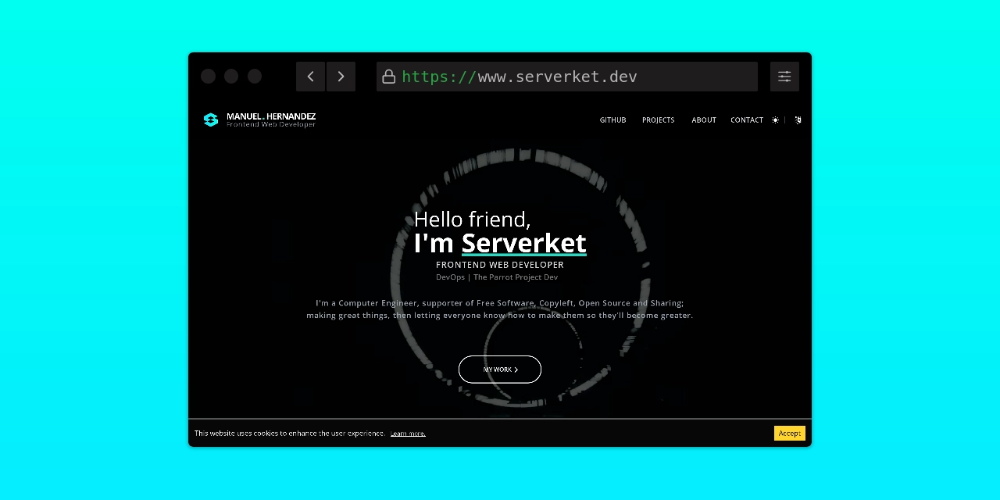

<div id="header" align="center">


# Personal Website &middot;  [](https://www.npmjs.com/package/react) [](LICENSE)
**An Universally Acclaimed Website**
</div>

## :gear: Install & Run
You'll need at least `node 16` and `bun` to compile everything up:

```
bun install

bun run dev
```

## :star2: Main features

**Frontend / UI:**
* React, React Context, React Router, Hooks and HOCs
* Tailwind CSS
* FormSubmit
* Fontello
* Vite

**Animations:**
* React-Spring (Hooks API)
* Tailwind Transitions

## :shipit: Special Thanks
* To Marco, aka <a rel="noopener noreferrer" href="https://github.com/th1rst">th1rst</a>, for his work of art.

* To <a rel="noopener noreferrer" href="https://www.youtube.com/@maxhay5426">Max</a>, for his video.

## :brain: Acknowledgments

*"Whoever loves discipline loves knowledge, but whoever hates correction is stupid."*